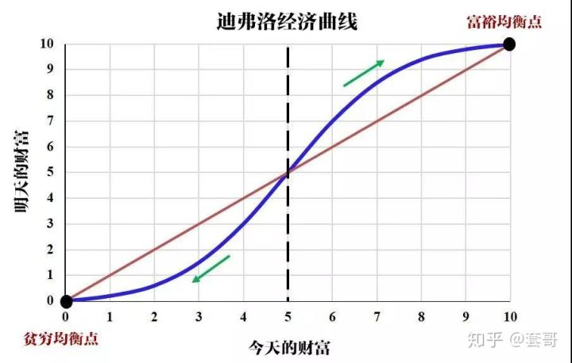

其中迪弗洛提出的经济曲线就十分引人思考。曲线的横坐标是今天财富，纵坐标是明天财富，如果说你的今天财富和明天财富一样多，也就是说你的财富一直没有发生变化，那么就是斜率为1的这条红色的直线。但实际上，并没有这么理想的状态，你的一次投资获利又或者是花费开销都会对你的财富产生影响，因此实际上这应该是一条S型曲线。

将这条曲线分为左右两部分，假设一开始你的起点是富裕的，那么就处于曲线右半部分，左半部分则是起点较为贫困的。

富人手头上资金充裕，通常会选择投资理财，让钱生钱，再加上他们的保险意识较高，假如有出现什么突发状况，还是能够及时止损，所以富人的财富会持续地往“富裕均衡点”方向移动。而相反，穷人本身处于经济状况的劣势，再加上大部分人的保险意识薄弱，他们只要经历一次生病或者是其他突如其来的意外，就可以让他们的财富大大损失，财富点也逐渐往“贫困均衡点”方向移动。

尽管自己拼命赚钱存钱，也总会被未知的风险摧毁，也正是因为这样，穷人会有一种根深蒂固的意识，认为自己是怎么都摆脱不了贫困，干脆选择即时享乐，不求长远。